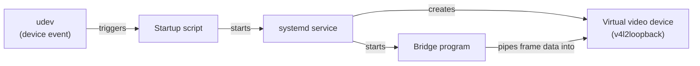

# OakD Daily — Startup Flow

```mermaid
flowchart LR
    udev["udev\n(device event)"] -->|"triggers"| script["Startup script"]
    script -->|"starts"| service["systemd service"]
    service -->|"creates"| vdev["Virtual video device\n(v4l2loopback)"]
    service -->|"starts"| bridge["Bridge program"]
    bridge -->|"pipes frame data into"| vdev
```
